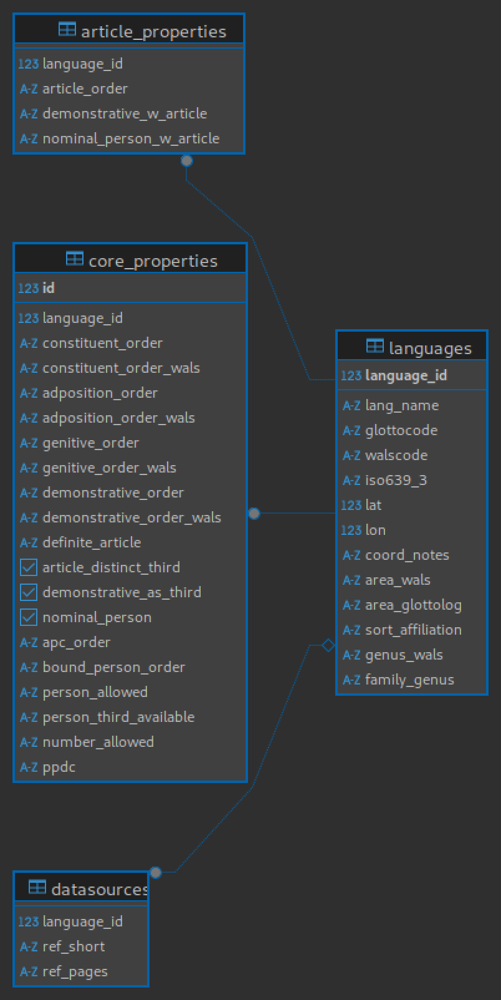

# Introduction

This repository contains a database with syntactic data on >100 languages with a focus on properties relating to the phenomenon of (ad)nominal person. One common form of nominal person are personal pronouns forming co-constituents of a co-referring nominal expression as in English *we linguists*.

More detailed information on relevant phenomena and the range of cross-linguistic variation can be found in [Höhn (2020)](https://doi.org/10.5334/gjgl.1121) and [Höhn (2024)](https://doi.org/10.1515/lingty-2023-0080) as well as [my dissertation](https://ling.auf.net/lingbuzz/003618). If you use this data, I'd appreciate it if you'd let me know. If you are a linguist interested in (ad)nominal person and struggle with using this database, feel free to get in touch.

Note that I am currently reconceptualising this database in [CLDF](https://github.com/cldf/cldf/), a format designed for linguistic applications which will be compatible with generation of an sqlite database as well. 
That newer version can be found [here](https://github.com/gfkpth/nominalperson_cldf) (currently work in progress). **Note that that will be the only version actively developed going forth.**

# Content of repository

- root level:
  - persn\_db.sqlite
  - persn\_postgresql\_dump.sql
  - requirements.txt *for python scripts/notebooks*
- [db-creation-notes/](db-creation-notes): folder documenting the process of creating the database from the original master .ods file as well as extraction of examples from a LaTeX file
- [2020-Glossa/](2020-Glossa): folder containing a csv file and R script from a [2020 Glossa article](https://doi.org/10.5334/gjgl.1121) on person restrictions in nominal person, based on a subset of the data in the main database
- [2024-LT/](2024-LT): folder containing a csv file and R script from a [2024 Linguistic Typology article](https://doi.org/10.1515/lingty-2023-0080) on word order correlations in nominal person, based on a (larger) subset of the data represented in the main database


# Background

The original data has so far been stored in an ods table and subsets have been published as csv files in the supplementary materials for articles in Glossa [(Höhn 2020)](https://doi.org/10.5334/gjgl.1121) and Linguistic Typology [(Höhn 2024)](https://doi.org/10.1515/lingty-2023-0080), see the [2020-Glossa](2020-Glossa) and [2024-LT](2024-LT) folders.

While a plain CSV/ODS table has been a sufficient -- and probably the most practical -- solution for my analytical purposes so far given the comparatively moderate size of the dataset (113 languages), I have two reasons for the endeavour of creating a database.

1. Making available my complete dataset on the phenomena. The datasets used in my *Glossa* and *Linguistic Typolog* papers address different aspects of nominal person, so they do not provide a full overview. Moreover, my master ODS file is not very tidy (containing extraneous notes, unused columns, extra columns for lookups of from other lists etc.). I have been thinking about an effective way of making a more comprehensive and tidier dataset publicly available, while also allowing scope for possible future extensions (or additional uses).

2. It provides an opportunity for exercising database design with SQL and data manipulation with python using a familiar dataset.


# Data preparation

The folder [db-creation-notes/](db-creation-notes) contains jupyter notebooks and notes on the data transformation process.

The SQL folder documents the process of converting the data from a plain csv file into sqlite/postgresql databases.

The CLDF folder contains [a notebook](db_creation_notes/CLDF/clld_preparation.ipynb) detailing the semi-automatic extraction process of examples of the linguistic phenomenon from a LaTeX file into a csv file ([examples.csv](db_creation_notes/CLDF/examples.csv)). The example dataset has not been included in the SQL database(s), but will be available in the CLDF-version once it becomes available (soon-ish).


# Format

For now, I plan to provide the database as an sqlite3 file and as a dump for postgresql, mainly because I wanted to try my hand at both. In case the database sees more extensive/dynamic use in the future, I may then decide to only maintain one version based on practical considerations.


# Data analysis

As of now, the most recent linguistic analyses of data from this dataset are [my dissertation](https://ling.auf.net/lingbuzz/003618), [Höhn (2020)](https://doi.org/10.5334/gjgl.1121) and [Höhn (2024)](https://doi.org/10.1515/lingty-2023-0080).


# Deploying the database

## postgresql

I am dumping the database for sharing on github using the following command:

```sh
pg_dump --table=table_name --no-owner --no-privileges -U your_username -d your_database -f table_dump.sql
```

In order to import the database, make sure postgresql is installed on your system and then use psql as follows (replace *username* by a user that has access to the database):

```sh
psql -U username -d persn -f persn_postgresql_dump.sql
```

You should then be able to access the database, e.g. using

```sh
psql -U username -d persn
```

Inside psql you can run the following code to check if the tables are intact (of course you can use another table than *languages* to test):

```SQL
SELECT * FROM languages;
```


## sqlite3

The database is in *persn_db.sqlite*. You can directly open it from the commandline as below (assuming you have sqlite3 installed on your system).

```sh 
sqlite3 persn_db.sqlite
```


# Using the database

I might add some more examples for using the database later, for now the sole subsection documents the structure of the database and comments on the meaning of each column.


## DB scheme



The languages and core\_properties tables effectively have a one-to-one mapping on the key *language\_id*, but are separated on conceptual grounds. The table languages contains non-structural properties of languoids, while core\_properties contains structural/(morpho-)syntactic properties relevant to the topic of the database. 


### Table *languages*

This table lists general, non-structural properties of languages/languoids. 

I am partial to the term *languoid* employed by [Glottolog](https://glottolog.org/glottolog/glottologinformation) to avoid the issue of "language" vs "dialect", but due to its wider familiarity in the descriptions below I mostly use the term language on this wider understanding. Note that the database does not contain information on family- or genus-level entities (although they are also languoids in the Glottolog sense and could technically be included). 

### Columns

language\_id *private key* 
: unique internal identifier

lang\_name
: English name of the language (extension to native and other names is possible, but probably not necessary at this point)


glottocode
: identifier for languoid in [Glottolog](glottolog.org) if available

walscode
: identifier for languoid in [WALS](wals.info) if available

iso639\_3
: language code according to ISO 639-3 if available

lat
: latitude of salient map point for language (mostly based on glottolog where available, in some cases WALS and manual)

lon
: longitude of salient map point for language (see lat)

coord\_notes
: notes regarding the choice or source of coordinates (lat/lon)

area\_wals
: macro area of the language following WALS classification

area\_glottolog
: macro area of the language following Glottolog classification

sort\_affiliation
: manual coding of phylogenetic information mostly for more accessible sorting of data presentation


genus\_WALS
: phylogenetic genus based on WALS where available (manually supplied otherwise)

family\_genus
: phylogenetic information including top-level family (mostly based on Glottolog) and, where applicable, genus information based on WALS


### Table *core\_properties*

This table lists (morpho-)syntactic properties of languoids. 


### Notes

1. Many of the basic word order properties are adapted from WALS with some minor deviations. WALS does not provide data for the full set of languages. For transparency, the \*\_wals columns provide the data supplied by WALS.

2. When working with the data, be aware that there are gaps in all contentful columns due to insufficient available data. Subset the data as necessary for your analytical purposes.

3. Currently, the columns intended to be boolean represent True by "y" and False by "n" in the sqlite version. This may be normalised down the road.

### Columns

id **private key*
: unique identifier 

language\_id
: foreign key referencing language\_id in **languages** table

constituent\_order
: dominant verb-object order  
  mostly based on WALS data where available with few exceptions (see Höhn 2024 for motivation)   
  values: OV, VO, NC (non-configurational), unclear

constituent\_order\_wals
: dominant verb-object order as provided by WALS  
  values: OV, VO, No dominant order

adposition\_order
: dominant order of adpositions relative to nominal complement  
  mostly based on WALS data  
  values: pre, post, NoDom, No Adpos, unclear

adposition\_order\_wals
: dominant order of adpositions relative to nominal complement as provided by WALS  
  values: pre, post, NoDom, No Adpos
  
genitive\_order
: dominant order of genitive modifiers relative to nominal head  
  mostly based on WALS data  
  values: GenN, NGen, NoDom, unclear
  
  
genitive\_order\_wals
: dominant order of genitive modifiers relative to nominal head as provided by WALS    
  values: GenN, NGen, NoDom

demonstrative\_order
: dominant order of demonstrative modifiers relative to nominal head  
  mostly based on WALS data
  values: DemN, NDem, mixed

demonstrative\_order
: dominant order of demonstrative modifiers relative to nominal head as provided by WALS  
  values: DemN, NDem, mixed

definite\_article
: Does the language have a definite article?  
  while intended to be a binary marking (y/n), several entries contain brief comments  
  if a clear binary value is needed, use article\_distinct\_third instead

article\_distinct\_third
: presence/absence of a definite article that is distinct from a third person pronoun  
  values: bool
  
demonstrative\_as\_third
: marks whether the language has a third person pronoun that is distinct from a demonstrative pronoun  
  y/True if a demonstrative is used as third person pronoun, n/False if there is a distinct third person pronoun
  values: bool
  
nominal\_person
: indicates whether an expression of nominal person is attested for the language  
  intended as a shorthand to identify datapoints relevant to the core subject of the database, equivalent to finding entries with NULL values in apc\_order and either NULL or False values in bound\_person\_order  
  Note that False/n values are very rare because the set of nominal person phenomena is already rarely discussed, so even fewer explicit statements that there is **no** such thing  
  values: bool  
  

apc\_order
: relative order of an adnominal pronoun in an adnominal pronoun construction (APC, "we linguists") relative to the remaining nominal expression  
  values: pre, post, both
  
bound\_person\_order
: relative order of a bound person marker in an bound person construction (e.g. in Khoekhoe/Nama) relative to the remaining nominal expression  
  values: pre, post, n
  
person\_allowed
: restrictions on grammatical persons occurring adnominally  
  contains question marks in cases where sources are suggestive, but not entirely specific  
  (if a more clear-cut dataset is desired, check person\_third\_available)  
  values: all (all persons can occur adnominally), no 3 (nominal person not marked in third person), only 3 (sources suggest only third person expressions allowed adnominally), unclear

person\_third\_available
: availability of third person adnominal person marking  
  contains question marks in cases where sources are suggestive, but not entirely specific  
  values: y (third person adnominal person is attested), n (third person adnominal person is ruled out, cf. English \*they linguists), only 3 (adnominal person attested only for third person), unclear


number\_allowed
: restrictions on number marking in adnominal person  
  values: all (no apparent number restrictions on nominal person expressions), non-sg (nominal person with non-singular reference), nonum (no grammatical number marking on pronouns), unclear, unclear(+pl) (plural is attested, other numbers unclear)
  

ppdc
: person/pronoun-demonstrative construction, availability of demonstratives co-occurring in expressions with nominal person marking  
  due to difficult ascertainment of data, negative value is not currently systematically marked  
  (some entries contain references, to be cleaned up later)
  value: y (PPDC attested), n (sufficient indications that PPDCs are not available)
  
  
*There are a few further syntactic properties that I hope to add in the next version.*

## Table *article\_properties*

This table contains information on articles in languages that have them. Coding this as a separate table avoids a proliferation of NULL values in the core\_properties table for the numerous languages without articles.


### Columns

language\_id
: foreign key referencing language\_id in **languages** table

article\_order
: relative order of definite article and head noun  
  values: ArtN, NArt
  
demonstrative\_w\_article
: marks if demonstrative modifiers co-occur with definite articles  
  conceptually this should have boolean values True or False (y/n), but I have practicaly not used this column much and it currently contains brief comments on many rows
  
nominal\_person\_w\_article
: marks if nominal person expressions can contain a definite article  
  values: y(es), n(o), unclear
  

# Table *data\_sources*

This table contains literature references for information on (ad)nominal person for specific languages. Currently, this only contains short author-year references. This might be expanded to contain full bibtex-style references if required.

### Columns

language\_id
: foreign key referencing language\_id in **languages** table

ref\_short
: a short author-year-style reference

ref\_page
: if relevant, more specific chapter, section or page information


# Major changes

This section notes any significant changes to the content or organisation of the database.

## 2025-07-24

- removed unnecessary rum cldf directory
- fixed issue with `Translated_Text` in generation of examples.csv in [db-creation-notes/CLDF/clld_preparation.ipynb](db-creation-notes/CLDF/clld_preparation.ipynb)


## 2025-04-23

- updated introduction in README to note future deprecation of this version of the dataset in favour of the [CLDF version](https://github.com/gfkpth/nominalperson_cldf).

## 2025-03-16

- uploaded intermediate state of bring-up of CLDF version of the database. The CLDF version is incomplete, but there is now a csv with examples of adnominal person from various languages (examples.csv), semi-automatically extracted from supplementary material to Höhn (2024).


# Acknowledgements

Part of the data reported here was collected while working in a project funded through the European Research Council Advanced Grant No. 269752 “Rethinking Comparative Syntax” (PI Ian Roberts).

# License

Note that the datasets and scripts in the [2020-Glossa](2020-Glossa) and [2024-LT](2024-LT) folders were published as part of the supplementary material to the respective articles (see above)

Shield: [![CC BY 4.0][cc-by-shield]][cc-by]

This work is licensed under a
[Creative Commons Attribution 4.0 International License][cc-by].

[![CC BY 4.0][cc-by-image]][cc-by]

[cc-by]: http://creativecommons.org/licenses/by/4.0/
[cc-by-image]: https://i.creativecommons.org/l/by/4.0/88x31.png
[cc-by-shield]: https://img.shields.io/badge/License-CC%20BY%204.0-lightgrey.svg
